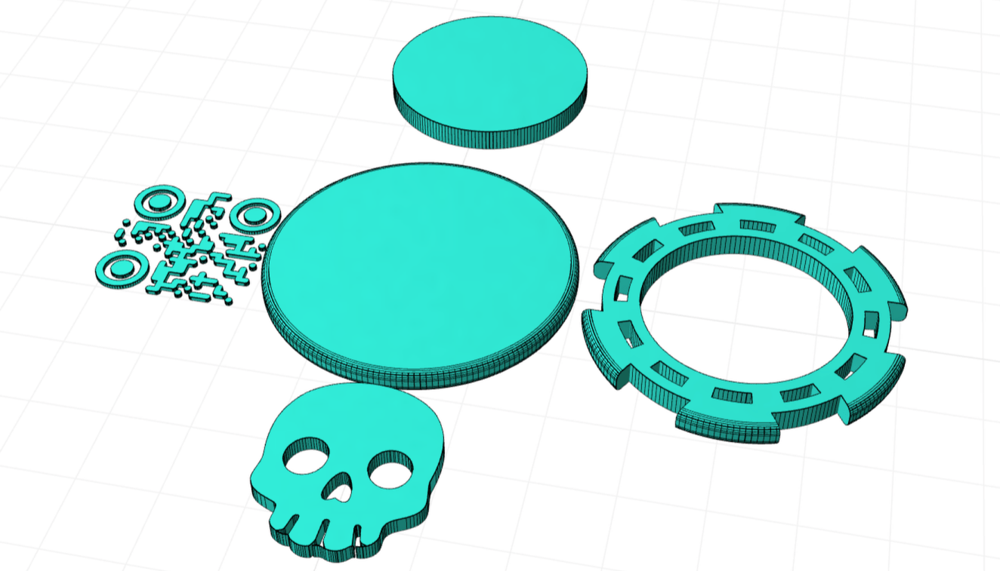

# @cadit-app/maker-chips

Generate customizable maker chips with various patterns and optional embedded QR codes. Perfect for multi-color 3D printing.



## Features

- **20 Pattern Styles**: Choose from a variety of decorative chip patterns
- **Customizable Dimensions**: Adjust radius, height, and edge rounding
- **Center Circle**: Add a center circle for additional customization
- **Multi-Color 3D Printing**: 3MF export with separate parts for multi-extruder printers
- **Assembly Modes**: Flat preview or assembled for printing
- **CLI Support**: Generate models directly from the command line

## Usage

### Open in CADit

Open this design in [CADit](https://app.cadit.app) to customize and generate your maker chip with a visual interface.

### Command Line

Generate 3D models directly from the command line:

```bash
# Install dependencies
pnpm install

# Generate a .glb file (3D model)
pnpm build:glb

# Generate a .3mf file (for multi-color 3D printing)
pnpm build:3mf

# Generate with custom parameters
npx tsx cli.ts my-chip.glb --radius 25 --markings makerChipV5
npx tsx cli.ts my-chip.3mf --markings makerChipV10 --assembly printable
```

### CLI Options

```
Usage:
  npx tsx cli.ts <output.[glb|3mf]> [options]

Output Formats:
  .glb   3D model (GLTF binary)
  .3mf   3D model for multi-color printing

Options:
  -r, --radius <number>        Chip radius in mm (default: 20)
  -h, --height <number>        Extrusion height in mm (default: 3)
  --rounding <number>          Edge rounding radius in mm (default: 1)
  --center-radius <number>     Center circle radius in mm (default: 14)
  -a, --assembly <type>        Assembly type: flat or printable (default: flat)
  -m, --markings <pattern>     Pattern style (default: makerChipV1)
  --help                       Show this help

Examples:
  npx tsx cli.ts chip.glb
  npx tsx cli.ts chip.3mf --markings makerChipV5 --radius 25
  npx tsx cli.ts chip.glb -m makerChipV10 -a printable
```

### Available Patterns

The following pattern styles are available:

`makerChipV1`, `makerChipV2`, `makerChipV3`, `makerChipV4`, `makerChipV5`,
`makerChipV6`, `makerChipV7`, `makerChipV8`, `makerChipV9`, `makerChipV10`,
`makerChipV11`, `makerChipV12`, `makerChipV13`, `makerChipV14`, `makerChipV15`,
`makerChipV16`, `makerChipV17`, `makerChipV18`, `makerChipV19`, `makerChipV20`

## Parameters

| Parameter | Type | Default | Description |
|-----------|------|---------|-------------|
| radius | number | 20 | Chip radius in millimeters |
| height | number | 3 | Extrusion height in millimeters |
| roundingRadius | number | 1 | Edge rounding radius in millimeters |
| centerCircleRadius | number | 14 | Center circle radius in millimeters |
| assemblyType | choice | flat | Assembly mode: flat (preview) or printable |
| markings | buttonGrid | makerChipV1 | Pattern style selection |

## Multi-Color Printing

The 3MF export includes separate parts assigned to different extruders:
- Part 1: Base disk (Extruder 1)
- Part 2: Center circle (Extruder 2)
- Part 3: Pattern/marking (Extruder 3)

This works with slicers like Bambu Studio, PrusaSlicer, and Cura.

## Attribution

This project is based on [Makerchip Maker Chip](https://makerworld.com/en/models/415825-makerchip-maker-chip) by K2_Kevin.

The original maker chip designs were manually converted to SVG and used as a starting point for this parametric generator.

**License**: [CC BY-NC-SA 4.0](https://creativecommons.org/licenses/by-nc-sa/4.0/)

---

<p align="center">
  <sub>Created with <a href="https://cadit.app">CADit</a> - The open platform for code-based 3D models.</sub>
</p>
